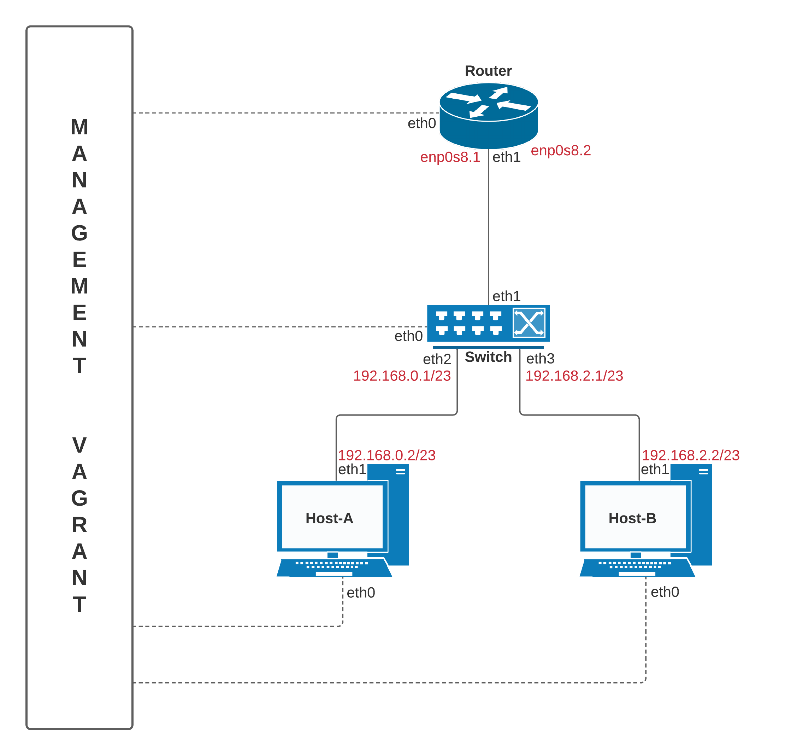
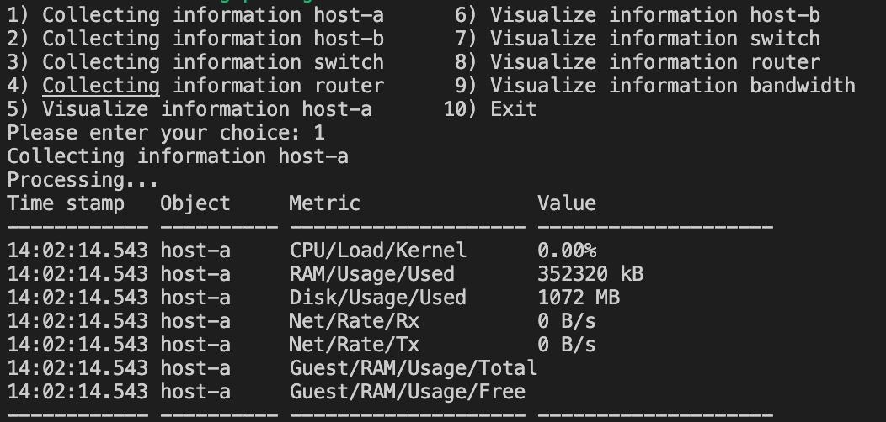
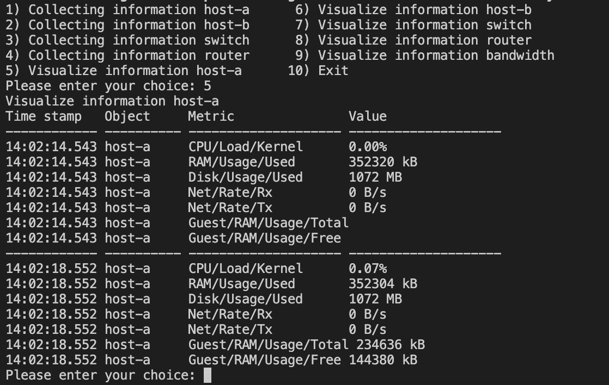
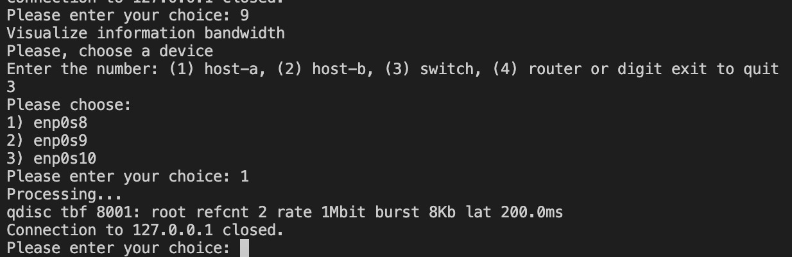

# Assignment

- To deploy a network of virtual machines/containers hosted on one or more PCs
- The connections between two VMs/containers should be bandwidth-limited (see Netem later)
- Networking should be based on OpenVSwitch
- To analyze the state of the system by collecting information about: VMs/containers resource utilization (CPU/memory/etc.) and link usage

## Suggested packages:

- Netem https://alexei-led.github.io/post/pumba_docker_netem/
- Docker/VM hypervisor monitoring APIs

## Design:



Come si può notare dall'immagine sopra illustrata, la nostra rete network è composta da: 
- 1 router
- 1 switch
- 2 host: host-a e host-b connessi allo switch

## Subnet:

- Subnet 1: 192.168.0.0/23 - sottorete presente tra host-a e router
- Subnet 1: 192.168.2.0/23 - sottorete presente tra host-b e router

Abbiamo scelto di utilizzare delle sottoreti più ampie invece che limitarci a delle sottoreti più piccole per rendere lo scenario il più realistico possibile, in quanto, nella realtà, si opera con delle sottoreti con vari host e non solamente due elementi come in questo caso.

Abbiamo deciso inoltre di creare due VLAN per distinguere subnet host-a e subnet host-b, codificandole rispettivamente con il tag 1 e 2. 


## IP map e VLAN:

| DEVICE            | IP                | INTERFACE           | SUBNET       |
| -------------     | -------------     | -------------       |------------- |
| router-1          | 192.168.0.1       | enp0s8.1            |     1        |
| host-a            | 192.168.0.2       | enp0s8              |     1        |
| router-1          | 192.168.2.1       | enp0s8.2            |     2        |
| host-b            | 192.168.2.2       | enp0s8              |     2        |


## Vagrantfile e file di configurazione .sh

Nel file chiamato Vagrantfile è presente tutta la configurazione di Vagrant. Più precisamente all'interno del file troviamo le impostazioni per ogni macchina virtuale.

Possiamo vedere come la rete sia composta da quattro macchine virtuali create attraverso VirtualBox, ognuna di queste ha una memoria di 256 MB, memoria che abbiamo tenuto bassa in quanto più che sufficiente per lo scopo del progetto. Inoltre ogni macchina virtuale viene creata in base anche alle specifiche presenti nei file ".sh" con i nomi delle macchine, dove, sono specificati sia i comandi necessari alla creazione della rete virtuale sia i comandi per limitarne l'ampiezza di banda. Successivamente entreremo più nello specifico per capire cosa avviene.

Questi file vengono invocati direttamente dal Vagrantfile quando viene costruita la rete virtuale. 

In ognuno di questi file di configurazione vengono definiti gli elementi principali per poter inserire all'interno della rete virtuale i quattro host.

- ```sudo ip addr add 192.168.0.2/23 dev enp0s8``` serve per assegnare l'indirizzo IP ad una specifica interfaccia della macchina virtuale;

- ```sudo ip link set dev enp0s8 up``` serve per attivare la connessione lungo un'interfaccia;

- ```sudo ip route add 192.168.0.0/22 via 192.168.0.1``` serve per specificare alla rete dove inviare i pacchetti diretti verso degli specifici indirizzi IP che sono fuori dalla sottorete a cui appartiene la macchina, facendo così definiamo il router gateway della sottorete per quegli indirizzi.

Questi comandi sono quelli necessari alla configurazione di base comune a tutte le macchine virtuali, ma per rendere la rete operativa e funzionante è necessario configurare a dovere anche il router e lo switch.

## Configurazione switch

Per configurare lo switch è stato necessario creare due VLAN per riuscire a dividere le due sottoreti che attraverso lo switch collegano uno dei due host con il router. Questo è stato possibile grazie a Open vSwitch, nello specifico attraverso i seguenti comandi:

```
sudo ovs-vsctl add-br switch
sudo ovs-vsctl add-port switch enp0s8
sudo ovs-vsctl add-port switch enp0s9 tag="1"
sudo ovs-vsctl add-port switch enp0s10 tag="2"
```

Come prima cosa, abbiamo creato un bridge, chiamato 'switch' per poter supportare le due VLAN necessarie. Abbiamo poi aggiunto le porte alle varie interfacce e, nel caso delle due collegate ai due host, abbiamo anche associato un tag, rispettivamente 1 e 2, in modo che, quando un pacchetto inviato da uno dei due host passerà attraverso lo switch, gli verrà associato il tag specifico della VLAN a cui appartiene. Facendo così, quando il pacchetto raggiungerà il router, questo sarà in grado di distinguere a quale delle due sottoreti appartiene.

## Configurazione router

Passando invece alla configurazione del router, vediamo che sono stati necessari un paio di comandi per poterlo utilizzare in maniera corretta. In primis abbiamo dovuto abilitare il forwarding degli indirizzi IP attraverso il seguente comando: 

```sudo sysctl -w net.ipv4.ip_forward=1```

Successivamente è stato necessario abilitare le connessione del router con le due VLAN provenienti dallo switch, per fare ciò è stato necessario specificare per ciascuna di queste connessioni il tag della VLAN, in modo che il router sia in grado di gestire questo tipo di traffico.

```
sudo ip link add link enp0s8 name enp0s8.1 type vlan id 
sudo ip link add link enp0s8 name enp0s8.2 type vlan id 2 
```

## Come limitare l'ampiezza di banda delle connessioni?

Una delle richieste del progetto era proprio quelle di avere delle connessioni con ampiezze di banda limitate. Per fare questo abbiamo utilizzato Linux Traffic Control, un utility di Linux creata apposta per poter gestire comodamente il traffico dati. Nello specifico abbiamo utilizzato il seguente comando:

```sudo tc qdisc add dev enp0s8 root tbf rate 1mbit burst 64kbit latency 200ms```

Una volta specificato in ogni macchina virtuale per ogni connessione, abbiamo una rete dove l'ampiezza di banda è limitata, in linea con la richiesta del progetto.

## Come analizzare lo stato del sistema?

Per riuscire ad analizzare correttamente lo stato del sistema, raccogliendo le informazioni relative, abbiamo creato uno script ad hoc dal nome tester.sh. 

Grazie a questo script è possibile raccogliere informazioni riguardo alle singole macchine virtuali, visualizzarle oppure controllare che l'ampiezza di banda sia limitata per ogni connessione. 



Per raccogliere le informazioni abbiamo utilizzato il seguente comando, specifico di VirtualBox, che dà come output le informazioni necessarie.

```VBoxManage metrics collect --period 4 --samples 1 host-a CPU/Loader/User,CPU/Load/Kernel,RAM/Usage/Used,Disk/Usage/Used,Net/Rate/Rx,Net/Rate/Tx,Guest/RAM/Usage/Total,Guest/RAM/Usage/Free | tee host-a.txt ```



Il tutto viene poi salvato in un file di testo che è possibile visualizzare con il rispettivo comando di visualizzazione sempre all'interno dello script "tester.sh"



Infine è possibile visualizzare che l'ampiezza di banda è limitata, all'interno di una qualunque connessione, attraverso una specifica opzione dove, selezionando la macchina virtuale da esaminare e la connessione, si lancia il seguente comando direttamente all'interno della macchina virtuale e si ricevono le informazioni richieste come output da terminale.

``` vagrant ssh host-a -c "sudo tc qdisc show dev enp0s8" ```

Per fare tutto questo basta accedere alla cartella contenente il progetto da un terminale e lanciare il comando "bash tester.sh", da qui ci sarà un menù interattivo per poter effettuare le procedure di analisi descritte precendentemente.

# Fonti 

https://netbeez.net/blog/how-to-use-the-linux-traffic-control/

https://docs.oracle.com/en/virtualization/virtualbox/6.0/user/vboxmanage-metrics.html